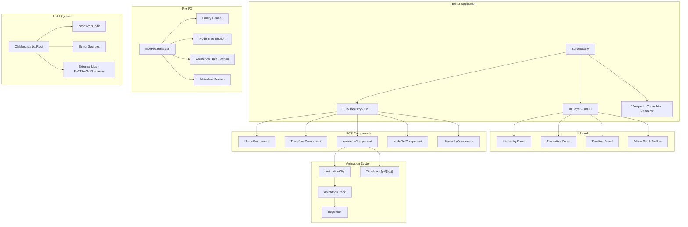
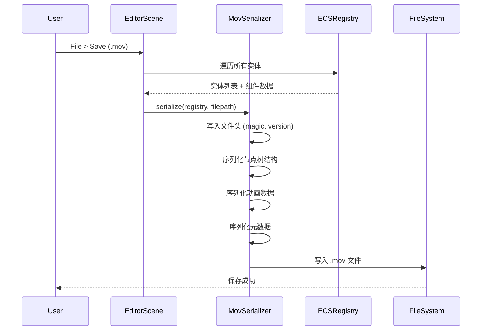
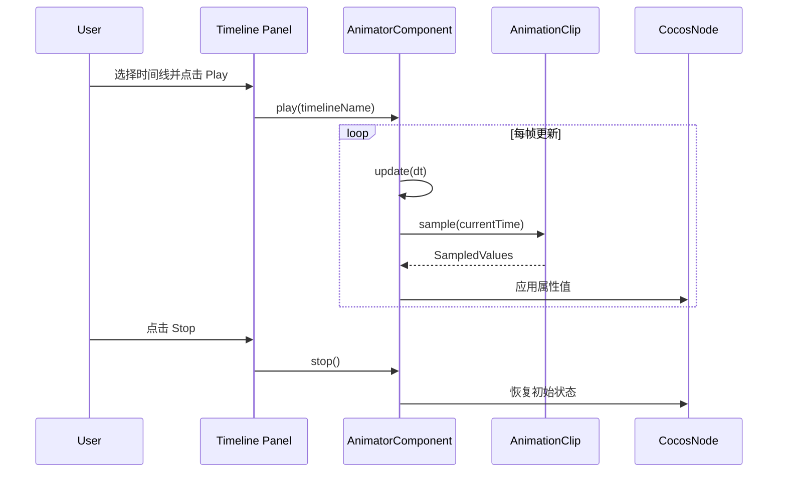
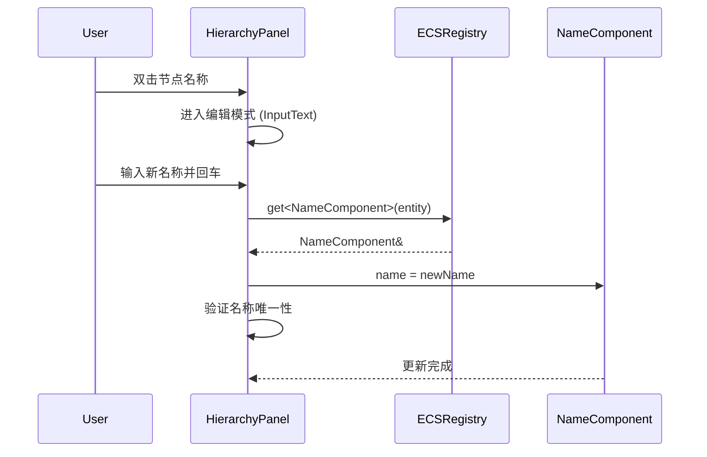

# Design Document: Animation Editor

## Overview

本设计文档描述一个基于 Cocos2d-x 的美术动画编辑器的核心功能扩展，包括：自定义 `.mov` 文件格式（用于序列化/反序列化节点树及动画数据）、多时间线动画系统（支持关键帧、多条独立时间线、右键菜单创建属性轨道）、节点命名系统（允许对节点树中任意节点重命名）、以及 CMake 构建系统的完善（从 VS 编译迁移到 CMake 直接编译运行）。

编辑器采用 Unity3D 风格的面板布局，已有 Hierarchy、Properties、Timeline、Viewport 四大面板。技术栈包括 Cocos2d-x（渲染引擎）、EnTT（ECS 实体组件系统）、ImGui（编辑器 UI）、Behaviac（行为树）。本次设计将在现有架构基础上引入 ECS 模式管理节点数据，并实现完整的文件序列化与多时间线动画播放能力。

## Architecture



## Sequence Diagrams

### 文件保存流程



### 多时间线动画播放流程



### 节点重命名流程




## Components and Interfaces

### Component 1: ECS 组件定义

**Purpose**: 使用 EnTT 的 ECS 模式管理编辑器中所有节点的数据，替代当前的 `EditorObject` 结构体。

**Interface**:

```cpp
// NameComponent - 节点命名
struct NameComponent {
    std::string name;
    std::string displayName; // 用户自定义显示名称（可重命名）
    bool isRenamable = true;
};

// TransformComponent - 变换数据（与 Cocos2d-x Node 同步）
struct TransformComponent {
    float posX = 0.0f, posY = 0.0f;
    float scaleX = 1.0f, scaleY = 1.0f;
    float rotation = 0.0f;
    float opacity = 255.0f;
};

// HierarchyComponent - 节点树父子关系
struct HierarchyComponent {
    entt::entity parent = entt::null;
    std::vector<entt::entity> children;
    int depth = 0;       // 树深度，用于 UI 缩进
    int sortOrder = 0;   // 同级排序
};

// NodeRefComponent - 关联 Cocos2d-x 节点
struct NodeRefComponent {
    cocos2d::Node* node = nullptr;
};

// AnimatorComponent - 多时间线动画控制器
struct AnimatorComponent {
    std::vector<Timeline> timelines;       // 多条时间线
    int activeTimelineIndex = -1;          // 当前激活的时间线索引
    float speed = 1.0f;
    WrapMode wrapMode = WrapMode::Once;
    PlayState state = PlayState::Stopped;
    float currentTime = 0.0f;
};
```

**Responsibilities**:
- 存储节点的所有可编辑属性
- 维护节点树的父子层级关系
- 管理多时间线动画数据
- 提供与 Cocos2d-x Node 的双向同步

### Component 2: 多时间线动画系统

**Purpose**: 支持一个节点拥有多条独立时间线，每条时间线可以描述不同的动画行为。

**Interface**:

```cpp
// 时间线 - 一组动画轨道的集合，描述一种完整的动画行为
struct Timeline {
    std::string name = "Default";
    std::vector<AnimationTrack> tracks;
    float duration = 0.0f;
    bool isLooping = false;

    AnimationTrack* addTrack(AnimProperty property);
    AnimationTrack* getTrack(AnimProperty property);
    void removeTrack(AnimProperty property);
    float getDuration() const;
    AnimationClip::SampledValues sample(float time) const;
};

// 动画轨道 - 单个属性的关键帧序列（已有，扩展）
struct AnimationTrack {
    AnimProperty property;
    std::vector<Keyframe> keyframes;

    void addKeyframe(float time, float value, EaseType ease = EaseType::Linear);
    void removeKeyframe(int index);
    float sample(float time) const;
    float getDuration() const;
};

// 关键帧（已有）
struct Keyframe {
    float time = 0.0f;
    float value = 0.0f;
    EaseType ease = EaseType::Linear;
};

// 动画属性枚举（扩展）
enum class AnimProperty {
    PositionX, PositionY,
    ScaleX, ScaleY,
    Rotation,
    Opacity,
    // 新增
    AnchorX, AnchorY,
    SkewX, SkewY,
    ColorR, ColorG, ColorB
};
```

**Responsibilities**:
- 管理多条独立时间线
- 每条时间线包含多个属性轨道
- 支持关键帧插值与缓动函数
- 提供采样接口用于实时预览

### Component 3: .mov 文件序列化器

**Purpose**: 自定义二进制文件格式，记录完整的节点树结构和动画数据。

**Interface**:

```cpp
class MovFileSerializer {
public:
    // 序列化整个场景到文件
    static bool save(const std::string& filepath, entt::registry& registry);
    // 从文件反序列化恢复场景
    static bool load(const std::string& filepath, entt::registry& registry,
                     cocos2d::Node* parentNode);

    // 文件格式版本
    static constexpr uint32_t MAGIC = 0x4D4F5646; // "MOVF"
    static constexpr uint32_t VERSION = 1;

private:
    // 内部序列化方法
    static void writeHeader(std::ofstream& stream);
    static void writeNodeTree(std::ofstream& stream, entt::registry& registry);
    static void writeAnimationData(std::ofstream& stream, entt::registry& registry);
    static void writeMetadata(std::ofstream& stream);

    static bool readHeader(std::ifstream& stream);
    static bool readNodeTree(std::ifstream& stream, entt::registry& registry,
                             cocos2d::Node* parentNode);
    static bool readAnimationData(std::ifstream& stream, entt::registry& registry);
    static bool readMetadata(std::ifstream& stream);
};
```

**Responsibilities**:
- 定义 `.mov` 二进制文件格式
- 序列化节点树层级结构
- 序列化所有动画时间线和关键帧数据
- 支持版本兼容和错误恢复

### Component 4: CMake 构建系统

**Purpose**: 完善 CMake 配置，使项目可以脱离 Visual Studio IDE 直接通过 CMake 编译运行。

**Interface**:

```cmake
# 顶层 CMakeLists.txt 结构
cmake_minimum_required(VERSION 3.16)
project(AnimationEditor)

# 编辑器源文件
set(EDITOR_SOURCES
    Classes/Editor/core/AnimTypes.h
    Classes/Editor/core/Animator.cpp
    Classes/Editor/core/Animator.h
    Classes/Editor/core/Timeline.cpp
    Classes/Editor/core/Timeline.h
    Classes/Editor/core/MovFileSerializer.cpp
    Classes/Editor/core/MovFileSerializer.h
    Classes/Editor/ui/EditorScene.cpp
    Classes/Editor/ui/EditorScene.h
    Classes/Editor/ui/HierarchyPanel.cpp
    Classes/Editor/ui/HierarchyPanel.h
    Classes/Editor/ui/TimelinePanel.cpp
    Classes/Editor/ui/TimelinePanel.h
    Classes/Editor/ui/PropertiesPanel.cpp
    Classes/Editor/ui/PropertiesPanel.h
)

# 外部库
add_subdirectory(Classes/External/imgui)
add_subdirectory(Classes/External/entt)
add_subdirectory(Classes/External/behaviac)
```

**Responsibilities**:
- 管理所有源文件和头文件的编译
- 正确链接 Cocos2d-x、ImGui、EnTT、Behaviac
- 支持 Debug/Release 配置
- 支持 Windows 平台直接编译运行


## Data Models

### Model 1: .mov 文件格式

```cpp
// 文件头结构
struct MovFileHeader {
    uint32_t magic;       // 0x4D4F5646 ("MOVF")
    uint32_t version;     // 文件格式版本号
    uint32_t nodeCount;   // 节点总数
    uint32_t flags;       // 保留标志位
    uint64_t timestamp;   // 文件创建/修改时间戳
};

// 节点数据块
struct MovNodeData {
    uint32_t entityId;        // 实体 ID
    uint32_t parentEntityId;  // 父实体 ID (0 = 根节点)
    uint16_t nameLength;      // 名称字符串长度
    // char name[nameLength]; // 名称字符串 (紧随其后)
    float posX, posY;
    float scaleX, scaleY;
    float rotation;
    float opacity;
    float anchorX, anchorY;
    uint32_t childCount;      // 子节点数量
};

// 动画数据块
struct MovAnimationData {
    uint32_t entityId;        // 所属实体 ID
    uint32_t timelineCount;   // 时间线数量
};

struct MovTimelineData {
    uint16_t nameLength;
    // char name[nameLength];
    uint32_t trackCount;
    float duration;
    uint8_t isLooping;
};

struct MovTrackData {
    uint8_t property;         // AnimProperty 枚举值
    uint32_t keyframeCount;
};

struct MovKeyframeData {
    float time;
    float value;
    uint8_t easeType;         // EaseType 枚举值
};
```

**Validation Rules**:
- magic 必须等于 0x4D4F5646
- version 必须 <= 当前支持的最大版本号
- nodeCount 必须 > 0（至少有根节点）
- parentEntityId 引用的实体必须在当前文件中存在或为 0
- keyframe 的 time 值必须单调递增
- property 枚举值必须在有效范围内

### Model 2: 多时间线数据模型

```cpp
// 完整的动画状态
struct AnimationState {
    enum class PlayState { Stopped, Playing, Paused };
    enum class WrapMode { Once, Loop, PingPong };

    PlayState state = PlayState::Stopped;
    WrapMode wrapMode = WrapMode::Once;
    float currentTime = 0.0f;
    float speed = 1.0f;
    bool pingPongForward = true;
};

// 采样结果
struct SampledValues {
    float posX = 0.0f, posY = 0.0f;
    float scaleX = 1.0f, scaleY = 1.0f;
    float rotation = 0.0f;
    float opacity = 255.0f;
    float anchorX = 0.5f, anchorY = 0.5f;
    float skewX = 0.0f, skewY = 0.0f;
    float colorR = 255.0f, colorG = 255.0f, colorB = 255.0f;
};
```

**Validation Rules**:
- speed 必须 > 0
- currentTime 必须 >= 0
- opacity 范围 [0, 255]
- scale 值不能为 0（避免矩阵奇异）

### Model 3: 节点命名规则

```cpp
struct NodeNamingRules {
    static constexpr size_t MAX_NAME_LENGTH = 128;
    static constexpr const char* DEFAULT_PREFIX = "Node_";

    // 验证名称合法性
    static bool isValidName(const std::string& name) {
        if (name.empty() || name.length() > MAX_NAME_LENGTH) return false;
        // 不允许特殊字符: / \ : * ? " < > |
        for (char c : name) {
            if (c == '/' || c == '\\' || c == ':' || c == '*' ||
                c == '?' || c == '"' || c == '<' || c == '>' || c == '|')
                return false;
        }
        return true;
    }

    // 生成唯一名称
    static std::string generateUniqueName(const std::string& baseName,
                                          const std::vector<std::string>& existingNames);
};
```


## Algorithmic Pseudocode

### 多时间线动画更新算法

```cpp
// 每帧调用，驱动当前激活时间线的播放
ALGORITHM updateAnimation(AnimatorComponent& animator, float dt)
INPUT: animator - 动画组件引用, dt - 帧间隔时间
OUTPUT: 更新节点属性

BEGIN
    IF animator.state != PlayState::Playing THEN
        RETURN
    END IF

    IF animator.activeTimelineIndex < 0 THEN
        RETURN
    END IF

    Timeline& timeline = animator.timelines[animator.activeTimelineIndex]
    float duration = timeline.getDuration()

    IF duration <= 0 THEN
        animator.state = PlayState::Stopped
        RETURN
    END IF

    // 推进时间
    animator.currentTime += dt * animator.speed

    // 根据 WrapMode 处理时间越界
    SWITCH animator.wrapMode
        CASE WrapMode::Once:
            IF animator.currentTime >= duration THEN
                animator.currentTime = duration
                applyTimelineSample(timeline, animator.currentTime, node)
                animator.state = PlayState::Stopped
                RETURN
            END IF

        CASE WrapMode::Loop:
            WHILE animator.currentTime >= duration DO
                animator.currentTime -= duration
            END WHILE

        CASE WrapMode::PingPong:
            IF animator.pingPongForward THEN
                IF animator.currentTime >= duration THEN
                    animator.currentTime = 2 * duration - animator.currentTime
                    animator.pingPongForward = false
                END IF
            ELSE
                animator.currentTime -= dt * animator.speed * 2  // 反向
                IF animator.currentTime <= 0 THEN
                    animator.currentTime = -animator.currentTime
                    animator.pingPongForward = true
                END IF
            END IF
    END SWITCH

    // 采样并应用
    applyTimelineSample(timeline, animator.currentTime, node)
END
```

### .mov 文件序列化算法

```cpp
ALGORITHM serializeToMov(registry, filepath)
INPUT: registry - EnTT 注册表, filepath - 目标文件路径
OUTPUT: bool - 是否成功

BEGIN
    std::ofstream file(filepath, std::ios::binary)
    IF NOT file.is_open() THEN
        RETURN false
    END IF

    // 1. 写入文件头
    MovFileHeader header
    header.magic = 0x4D4F5646
    header.version = VERSION
    header.nodeCount = registry.size<NodeRefComponent>()
    header.flags = 0
    header.timestamp = currentTimestamp()
    file.write(&header, sizeof(header))

    // 2. 序列化节点树（深度优先遍历）
    auto rootEntities = findRootEntities(registry)
    FOR EACH rootEntity IN rootEntities DO
        serializeNodeRecursive(file, registry, rootEntity)
    END FOR

    // 3. 序列化动画数据
    auto animView = registry.view<AnimatorComponent>()
    FOR EACH [entity, animator] IN animView DO
        MovAnimationData animData
        animData.entityId = (uint32_t)entity
        animData.timelineCount = animator.timelines.size()
        file.write(&animData, sizeof(animData))

        FOR EACH timeline IN animator.timelines DO
            serializeTimeline(file, timeline)
        END FOR
    END FOR

    file.close()
    RETURN true
END

ALGORITHM serializeNodeRecursive(file, registry, entity)
INPUT: file - 输出流, registry - 注册表, entity - 当前实体
OUTPUT: 写入节点数据到文件

BEGIN
    auto& name = registry.get<NameComponent>(entity)
    auto& transform = registry.get<TransformComponent>(entity)
    auto& hierarchy = registry.get<HierarchyComponent>(entity)

    MovNodeData nodeData
    nodeData.entityId = (uint32_t)entity
    nodeData.parentEntityId = (hierarchy.parent != entt::null) ? (uint32_t)hierarchy.parent : 0
    nodeData.nameLength = name.displayName.length()
    nodeData.posX = transform.posX
    nodeData.posY = transform.posY
    nodeData.scaleX = transform.scaleX
    nodeData.scaleY = transform.scaleY
    nodeData.rotation = transform.rotation
    nodeData.opacity = transform.opacity
    nodeData.childCount = hierarchy.children.size()

    file.write(&nodeData, sizeof(nodeData))
    file.write(name.displayName.c_str(), nodeData.nameLength)

    // 递归序列化子节点
    FOR EACH child IN hierarchy.children DO
        serializeNodeRecursive(file, registry, child)
    END FOR
END
```

### 关键帧插值算法

```cpp
ALGORITHM sampleTrack(track, time) -> float
INPUT: track - 动画轨道, time - 采样时间点
OUTPUT: 插值后的属性值

BEGIN
    IF track.keyframes.empty() THEN
        RETURN 0.0f
    END IF

    IF track.keyframes.size() == 1 THEN
        RETURN track.keyframes[0].value
    END IF

    // 边界情况
    IF time <= track.keyframes.front().time THEN
        RETURN track.keyframes.front().value
    END IF
    IF time >= track.keyframes.back().time THEN
        RETURN track.keyframes.back().value
    END IF

    // 二分查找相邻关键帧
    int lo = 0, hi = track.keyframes.size() - 1
    WHILE lo < hi - 1 DO
        int mid = (lo + hi) / 2
        IF track.keyframes[mid].time <= time THEN
            lo = mid
        ELSE
            hi = mid
        END IF
    END WHILE

    Keyframe& kf0 = track.keyframes[lo]
    Keyframe& kf1 = track.keyframes[hi]

    // 计算归一化时间 t ∈ [0, 1]
    float t = (time - kf0.time) / (kf1.time - kf0.time)

    // 应用缓动函数
    t = applyEase(t, kf1.ease)

    // 线性插值
    RETURN kf0.value + (kf1.value - kf0.value) * t
END
```


## Key Functions with Formal Specifications

### Function 1: Timeline::sample()

```cpp
SampledValues Timeline::sample(float time) const;
```

**Preconditions:**
- `time >= 0.0f`
- `this->tracks` 中所有轨道的 keyframes 已按 time 升序排列

**Postconditions:**
- 返回的 `SampledValues` 中每个属性值等于对应轨道在 `time` 时刻的插值结果
- 若某属性无对应轨道，则返回该属性的默认值
- 不修改 Timeline 的任何内部状态（const 方法）

**Loop Invariants:**
- 遍历 tracks 时，已处理的轨道结果已正确写入 SampledValues 对应字段

### Function 2: MovFileSerializer::save()

```cpp
static bool MovFileSerializer::save(const std::string& filepath, entt::registry& registry);
```

**Preconditions:**
- `filepath` 是合法的文件系统路径且目录存在
- `registry` 中至少包含一个具有 `NodeRefComponent` 的实体
- 所有实体的 `HierarchyComponent` 构成合法的树结构（无环）

**Postconditions:**
- 若返回 true：文件已成功写入，内容符合 .mov 格式规范
- 若返回 false：文件系统未被修改（原子性保证）
- 写入的节点数量等于 registry 中 `NodeRefComponent` 实体数量
- 写入的动画数据与 registry 中 `AnimatorComponent` 数据一致

**Loop Invariants:**
- 深度优先遍历节点树时，父节点总是在子节点之前被写入

### Function 3: MovFileSerializer::load()

```cpp
static bool MovFileSerializer::load(const std::string& filepath, entt::registry& registry,
                                     cocos2d::Node* parentNode);
```

**Preconditions:**
- `filepath` 指向一个存在的合法 .mov 文件
- `registry` 为空或调用者接受现有数据被覆盖
- `parentNode` 非空且已添加到场景中

**Postconditions:**
- 若返回 true：registry 中包含文件描述的所有实体和组件
- 所有 `NodeRefComponent::node` 指向已创建并添加到场景树的 Cocos2d-x 节点
- 节点的父子关系与文件中记录的层级结构一致
- 若返回 false：registry 和 parentNode 保持调用前状态

**Loop Invariants:** N/A

### Function 4: NodeNamingRules::generateUniqueName()

```cpp
static std::string generateUniqueName(const std::string& baseName,
                                       const std::vector<std::string>& existingNames);
```

**Preconditions:**
- `baseName` 通过 `isValidName()` 验证
- `existingNames` 包含当前所有已使用的名称

**Postconditions:**
- 返回的名称通过 `isValidName()` 验证
- 返回的名称不在 `existingNames` 中（唯一性）
- 若 `baseName` 不在 `existingNames` 中，直接返回 `baseName`
- 若冲突，返回格式为 `baseName_N` 的名称（N 为最小可用正整数）

**Loop Invariants:**
- 每次循环递增 N，检查 `baseName_N` 是否在 existingNames 中

### Function 5: AnimatorComponent 多时间线切换

```cpp
void AnimatorComponent::switchTimeline(int timelineIndex);
```

**Preconditions:**
- `timelineIndex >= 0 && timelineIndex < timelines.size()`

**Postconditions:**
- `activeTimelineIndex == timelineIndex`
- `currentTime == 0.0f`（重置播放位置）
- `state == PlayState::Stopped`（切换时间线自动停止播放）
- 节点属性恢复到初始状态

**Loop Invariants:** N/A


## Example Usage

```cpp
// ===== 示例 1: 创建多时间线动画 =====
entt::registry registry;
auto entity = registry.create();

// 添加基础组件
registry.emplace<NameComponent>(entity, "Player", "Player", true);
registry.emplace<TransformComponent>(entity, 100.0f, 200.0f, 1.0f, 1.0f, 0.0f, 255.0f);
registry.emplace<HierarchyComponent>(entity);

// 添加动画组件并创建多条时间线
auto& animator = registry.emplace<AnimatorComponent>(entity);

// 时间线1: 从A移动到B并逐渐变大
Timeline& moveAndGrow = animator.timelines.emplace_back();
moveAndGrow.name = "MoveAndGrow";
auto* trackPosX = moveAndGrow.addTrack(AnimProperty::PositionX);
trackPosX->addKeyframe(0.0f, 100.0f);
trackPosX->addKeyframe(1.0f, 400.0f, EaseType::EaseInOut);

auto* trackScaleX = moveAndGrow.addTrack(AnimProperty::ScaleX);
trackScaleX->addKeyframe(0.0f, 1.0f);
trackScaleX->addKeyframe(1.0f, 2.0f, EaseType::EaseOut);

auto* trackScaleY = moveAndGrow.addTrack(AnimProperty::ScaleY);
trackScaleY->addKeyframe(0.0f, 1.0f);
trackScaleY->addKeyframe(1.0f, 2.0f, EaseType::EaseOut);

// 时间线2: 旋转并淡出
Timeline& spinAndFade = animator.timelines.emplace_back();
spinAndFade.name = "SpinAndFade";
auto* trackRot = spinAndFade.addTrack(AnimProperty::Rotation);
trackRot->addKeyframe(0.0f, 0.0f);
trackRot->addKeyframe(2.0f, 720.0f, EaseType::EaseInOut);

auto* trackOpacity = spinAndFade.addTrack(AnimProperty::Opacity);
trackOpacity->addKeyframe(0.0f, 255.0f);
trackOpacity->addKeyframe(1.5f, 255.0f);
trackOpacity->addKeyframe(2.0f, 0.0f, EaseType::EaseIn);

// 播放第一条时间线
animator.activeTimelineIndex = 0;
animator.state = PlayState::Playing;


// ===== 示例 2: 保存和加载 .mov 文件 =====
// 保存
bool saved = MovFileSerializer::save("assets/player_anim.mov", registry);
assert(saved);

// 加载到新场景
entt::registry newRegistry;
cocos2d::Node* sceneRoot = cocos2d::Node::create();
bool loaded = MovFileSerializer::load("assets/player_anim.mov", newRegistry, sceneRoot);
assert(loaded);


// ===== 示例 3: 节点重命名 =====
auto& name = registry.get<NameComponent>(entity);
std::string newName = "Hero_Character";

if (NodeNamingRules::isValidName(newName)) {
    // 收集所有现有名称
    std::vector<std::string> existingNames;
    registry.view<NameComponent>().each([&](auto& nc) {
        existingNames.push_back(nc.displayName);
    });

    // 生成唯一名称
    name.displayName = NodeNamingRules::generateUniqueName(newName, existingNames);
}


// ===== 示例 4: 右键菜单创建动画轨道 =====
// 在 Timeline Panel 中右键点击
if (ImGui::BeginPopupContextWindow("TimelineContext")) {
    if (ImGui::BeginMenu("Add Property Track")) {
        auto& animator = registry.get<AnimatorComponent>(selectedEntity);
        Timeline& timeline = animator.timelines[animator.activeTimelineIndex];

        if (ImGui::MenuItem("Position X") && !timeline.getTrack(AnimProperty::PositionX)) {
            timeline.addTrack(AnimProperty::PositionX);
        }
        if (ImGui::MenuItem("Position Y") && !timeline.getTrack(AnimProperty::PositionY)) {
            timeline.addTrack(AnimProperty::PositionY);
        }
        if (ImGui::MenuItem("Scale X") && !timeline.getTrack(AnimProperty::ScaleX)) {
            timeline.addTrack(AnimProperty::ScaleX);
        }
        if (ImGui::MenuItem("Rotation") && !timeline.getTrack(AnimProperty::Rotation)) {
            timeline.addTrack(AnimProperty::Rotation);
        }
        if (ImGui::MenuItem("Opacity") && !timeline.getTrack(AnimProperty::Opacity)) {
            timeline.addTrack(AnimProperty::Opacity);
        }
        ImGui::EndMenu();
    }
    ImGui::EndPopup();
}
```


## Correctness Properties

*A property is a characteristic or behavior that should hold true across all valid executions of a system-essentially, a formal statement about what the system should do. Properties serve as the bridge between human-readable specifications and machine-verifiable correctness guarantees.*

### Property 1: Serialization Round-Trip Consistency

*For any* valid Registry containing nodes with NameComponent, TransformComponent, HierarchyComponent, and AnimatorComponent data, serializing to a .mov file and then deserializing back into a new Registry SHALL produce an equivalent data set (same node names, transforms, hierarchy relationships, timelines, tracks, and keyframes).

**Validates: Requirements 1.6, 2.1**

### Property 2: Serialization Idempotence

*For any* valid Registry, saving to file A, loading from file A into a new Registry, then saving that new Registry to file B SHALL produce files A and B with identical data content (excluding timestamp).

**Validates: Requirements 1.1, 1.6**

### Property 3: Depth-First Serialization Ordering

*For any* node tree, the serialized output SHALL contain every parent node before any of its children (depth-first pre-order traversal).

**Validates: Requirements 1.3, 8.4**

### Property 4: Failed Load Preserves State

*For any* invalid .mov file (wrong magic, unsupported version, malformed data, or failed validation), attempting to load it SHALL leave the Registry in its pre-load state with no entities added or modified.

**Validates: Requirements 2.5, 11.4**

### Property 5: Keyframe Ordering Invariant

*For any* AnimationTrack, after any sequence of addKeyframe or removeKeyframe operations, the keyframes within the track SHALL remain sorted in ascending order by time.

**Validates: Requirements 4.7**

### Property 6: Sampling Boundary Correctness

*For any* AnimationTrack with one or more keyframes: sampling at a keyframe's exact time SHALL return that keyframe's exact value; sampling before the first keyframe SHALL return the first keyframe's value; sampling after the last keyframe SHALL return the last keyframe's value.

**Validates: Requirements 4.2, 4.3, 4.4, 4.6**

### Property 7: Timeline Independence

*For any* entity with multiple Timelines, playing timeline at index i SHALL not modify any data (tracks, keyframes, name, duration, isLooping) of any other timeline at index j where j ≠ i.

**Validates: Requirements 3.5**

### Property 8: Timeline Switch State Reset

*For any* AnimatorComponent in any PlayState with any currentTime value, switching to a different timeline by index SHALL result in activeTimelineIndex equal to the new index, currentTime equal to zero, and PlayState equal to Stopped.

**Validates: Requirements 3.3**

### Property 9: WrapMode Loop Periodicity

*For any* Timeline with WrapMode Loop and duration > 0, and for any time t >= 0 and any positive integer N, sampling at time t SHALL produce the same values as sampling at time t + N * duration.

**Validates: Requirements 5.5**

### Property 10: Node Name Uniqueness Invariant

*For any* Registry, after any sequence of node creation and rename operations, all entity displayName values SHALL be pairwise distinct (no two entities share the same displayName).

**Validates: Requirements 7.4, 7.5**

### Property 11: Name Validation Determinism and Correctness

*For any* string, isValidName SHALL return false if and only if the string is empty, exceeds 128 characters, or contains at least one of the forbidden characters (/ \\ : * ? " < > |). The result SHALL depend only on the string content.

**Validates: Requirements 7.2, 7.3**

### Property 12: Node Tree Acyclicity

*For any* entity in the Registry, traversing the parent chain via HierarchyComponent.parent SHALL reach entt::null within a number of steps equal to or less than the total entity count (no cycles exist in the hierarchy).

**Validates: Requirements 8.1, 8.2, 8.3**

### Property 13: File Validation Rejects Invalid Input

*For any* byte sequence that does not begin with the magic number 0x4D4F5646, or contains nodeCount exceeding the upper limit, or contains nameLength exceeding 128, or contains keyframe times that are negative or not in ascending order, the Serializer load operation SHALL return false.

**Validates: Requirements 2.2, 2.3, 11.1, 11.2, 11.3**

### Property 14: Path Traversal Rejection

*For any* file path string containing the subsequence ".." or an unexpected absolute path prefix, the Serializer SHALL reject the operation.

**Validates: Requirements 11.5**

## Error Handling

### Error Scenario 1: 文件读取失败

**Condition**: .mov 文件不存在、权限不足、或文件损坏（magic 不匹配）
**Response**: `load()` 返回 false，通过日志输出具体错误原因
**Recovery**: registry 和场景树保持调用前状态，UI 显示错误提示对话框

### Error Scenario 2: 文件版本不兼容

**Condition**: .mov 文件的 version 字段大于当前支持的最大版本
**Response**: `load()` 返回 false，日志提示需要更新编辑器版本
**Recovery**: 不修改任何状态，建议用户升级编辑器

### Error Scenario 3: 节点名称冲突

**Condition**: 用户重命名节点时输入了已存在的名称
**Response**: 自动追加数字后缀生成唯一名称（如 "Node_1" → "Node_2"）
**Recovery**: 名称始终保持唯一，UI 显示最终使用的名称

### Error Scenario 4: 动画数据异常

**Condition**: 关键帧时间为负数、或轨道中关键帧未排序
**Response**: 自动修正（clamp 负时间为 0，重新排序关键帧）
**Recovery**: 记录警告日志，动画系统继续正常工作

### Error Scenario 5: 节点树循环引用

**Condition**: 拖拽操作导致节点成为自身的子孙节点
**Response**: 拒绝该操作，保持原有层级结构
**Recovery**: UI 显示 "Cannot create circular hierarchy" 提示

### Error Scenario 6: CMake 构建失败

**Condition**: 缺少依赖库、路径配置错误
**Response**: CMake 输出明确的错误信息指示缺少的组件
**Recovery**: 提供 README 文档说明环境配置步骤

## Testing Strategy

### Unit Testing Approach

- 使用 Google Test 框架
- 测试关键帧插值的数学正确性（线性、各种缓动函数）
- 测试节点命名的唯一性保证和验证规则
- 测试 .mov 文件的序列化/反序列化往返一致性
- 测试多时间线的独立性和切换逻辑
- 测试 WrapMode 的边界行为（Loop 周期性、PingPong 反转点）

**Key Test Cases**:
- 空轨道采样返回默认值
- 单关键帧轨道在任意时间返回该关键帧值
- 两个关键帧之间的线性插值精度
- 各缓动函数在 t=0 和 t=1 时的边界值
- 保存空场景、单节点场景、深层嵌套场景
- 名称包含特殊字符时的拒绝行为

### Property-Based Testing Approach

**Property Test Library**: 自定义 fuzzing 或集成 RapidCheck (C++ property-based testing)

**Properties to Test**:
- 任意关键帧序列经排序后，采样结果在相邻关键帧之间单调变化（对线性插值）
- 任意合法 registry 数据经 save/load 往返后数据等价
- 任意合法名称经 generateUniqueName 后结果通过 isValidName 验证
- 任意 WrapMode::Loop 动画，sample(t) == sample(t + N*duration) 对所有正整数 N

### Integration Testing Approach

- 测试完整的编辑器工作流：创建节点 → 添加动画 → 保存 → 加载 → 播放
- 测试 ImGui UI 交互与 ECS 数据的同步
- 测试 CMake 构建在 Windows 平台的完整编译链接
- 测试大规模场景（100+ 节点，多时间线）的性能表现

## Performance Considerations

- **关键帧查找优化**: 当前使用线性搜索，对于大量关键帧（>100）应改用二分查找
- **内存布局**: ECS 组件使用 SoA (Structure of Arrays) 布局，利用 EnTT 的缓存友好特性
- **文件 I/O**: 使用缓冲写入，避免频繁的小块磁盘操作
- **UI 渲染**: Timeline 面板仅渲染可见区域的关键帧菱形标记，避免绘制屏幕外元素
- **动画更新**: 仅更新处于 Playing 状态的 AnimatorComponent，使用 EnTT 的 view 过滤

## Security Considerations

- **文件格式验证**: 加载 .mov 文件时严格验证所有字段范围，防止缓冲区溢出
- **路径遍历防护**: 文件保存/加载路径不允许包含 `..` 或绝对路径前缀
- **整数溢出检查**: nodeCount、trackCount 等计数字段在分配内存前检查合理上限
- **字符串长度限制**: 名称字段有最大长度限制（128 字符），防止内存耗尽

## Dependencies

| 依赖 | 版本 | 用途 |
|------|------|------|
| Cocos2d-x | 3.x | 游戏引擎、渲染、场景管理 |
| EnTT | latest | ECS 实体组件系统 |
| ImGui | latest | 编辑器 UI 面板 |
| Behaviac | latest | 行为树（未来扩展） |
| CMake | >= 3.16 | 构建系统 |
| Google Test | latest | 单元测试框架（可选） |

